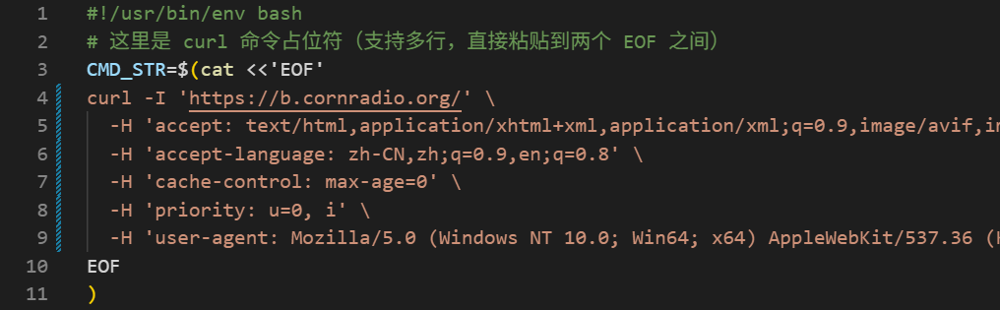

## 实用步骤

1. doit.sh 放到服务器上
2. 用 crontab 定时执行命令，如五分钟执行一次
3. 定期来看 log.txt

```
chmod +x doit.sh
crontab -e
*/5 * * * * /bin/bash /root/doit.sh
crontab -l
```

自定义 curl 命令需要修改这段：curl 需要 -I 参数来识别httpcode判断是否200（成功）


程序还提供了一个 index.html ，导入 logl.txt 可以方便的可视化分析日志内容。


此应用的code为ai生成，主打一个能用就行。